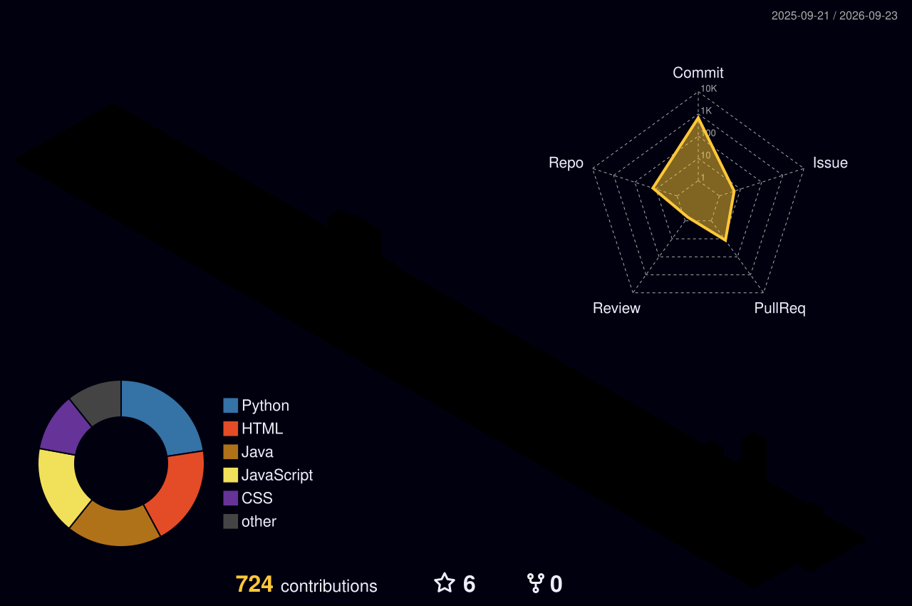

  

  

 

  

 

  

  

  

  

  

  

 

  

 

## 🌱 Currently Learning

| 🚀 Area | 📚 Focus |
| :---: | :--- |
| 🐍 Python | Advanced Python & Automation |
| 🌐 Full-Stack | Frontend + Backend Development |
| 🤖 AI | Artificial Intelligence & Machine Learning |
| 🧠 DSA | Data Structures & Algorithms |
| 💻 Software Engineering | Clean & Scalable Code |

 

  

  

  

 

## 💻 Most Used Languages

  

 

  

  

 

  

  

 

## 🧊 3D Contribution Graph

  

 

  

  

  

  

  

 

  

  

  

  

 

## 💭 Developer Quote

  <b>"Consistency beats motivation."</b>

 

  

